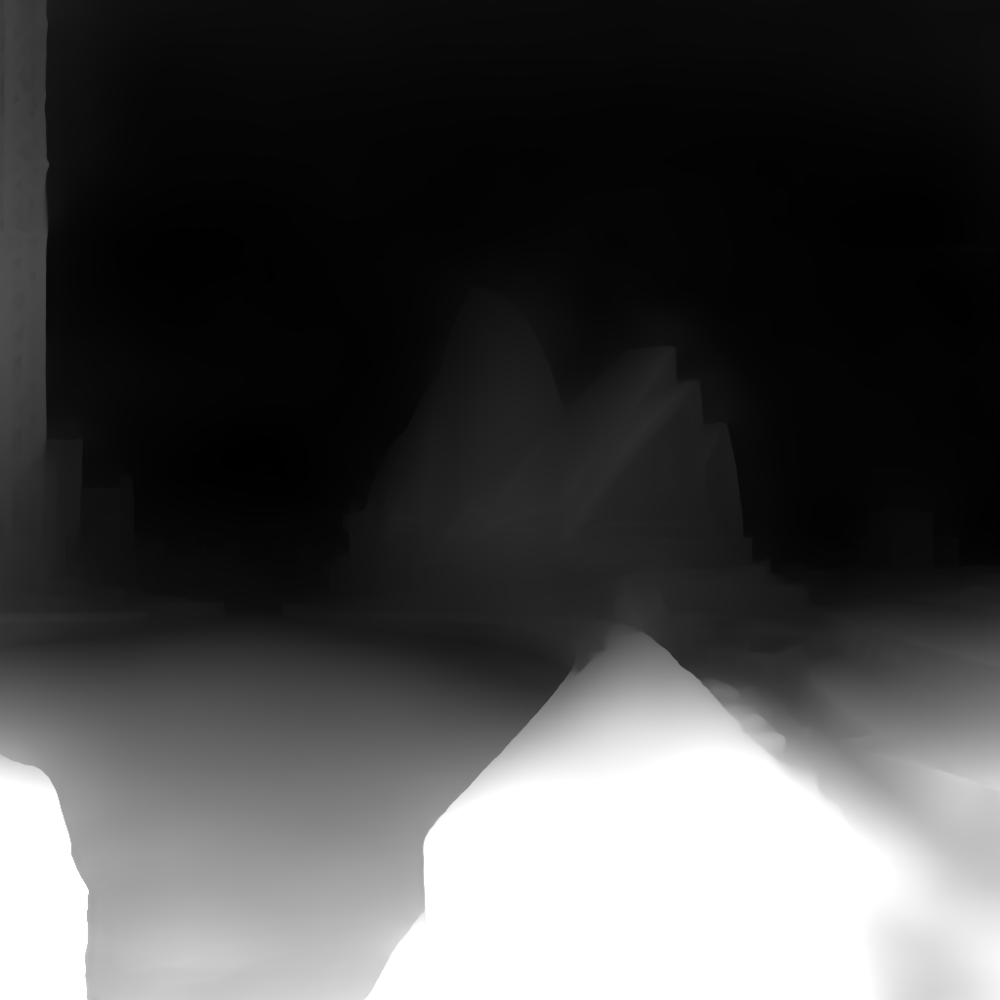

### Welcome to the Pytorch implementation of paper "SinMPI: Novel View Synthesis from a Single Image with Expanded Multiplane Images" (SIGGRAPH Asia 2023).

## Quick demo

### 1. Prepare

(1) Create a new conda environment specified in requirements.txt.

(2) Download pretrained weights of depth-aware inpainter [ecweights](https://drive.google.com/drive/folders/1FZZ6laPuqEMSfrGvEWYaDZWEPaHvGm6r) and put them in to 'warpback/ecweights/xxx.pth'.

### 2. Run demo
```
sh scripts/train_all.sh
```
This demo converts 'test_images/Syndney.jpg' to an expanded MPI and renders novel views as in 'ckpts/Exp-Syndney-new/MPI_rendered_views.mp4'.

## What happens when running the demo?

### 1. Outpaint the input image

In the above demo, we specify 'test_images/Syndney.jpg'


as the input image, then we continuously outpaint the input image:
```
CUDA_VISIBLE_DEVICES=$cuda python outpaint_rgbd.py \
    --width $width \
    --height $height \
    --ckpt_path $ckpt_path \
    --img_path $img_path \
    --extrapolate_times $extrapolate_times
```
Then we get the outpainted image and its depth estimated by a monocular depth estimator (DPT):

 

### 2. Finetune Depth-aware Inpainter and create Pseudo-multi-view images

```
CUDA_VISIBLE_DEVICES=$cuda python train_inpainting.py \
     --width $width \
     --height $height \
     --ckpt_path $ckpt_path \
     --img_path $img_path \
     --num_epochs 10  \
     --extrapolate_times $extrapolate_times \
     --batch_size 1  #--load_warp_pairs --debugging 
```

### 3. Optimizing the expanded MPI

```
CUDA_VISIBLE_DEVICES=$cuda python train_mpi.py \
    --width $width \
    --height $height \
    --ckpt_path $ckpt_path \
    --img_path $img_path \
    --num_epochs 10 \
    --extrapolate_times $extrapolate_times \
    --batch_size 1 #--debugging #--resume
```

After optimization, we render novel views:


## Toward Better quality and robustness

Notice the above demo is designed for fast illustration (FPS is low). For better quality: 

#### Pesudo-multi-views should be more and cover more areas.
Increasing the sample rate and sample areas helps to optimize MPI with better quality. To add training and rendering view trajectories, modify 'dataloaders/single_img_data.py'.
#### More training epochs are needed. 

## Cite our paper

If you find our work helpful, please cite our paper. Thank you!

ACM Reference Format:
```
Guo Pu, Peng-Shuai Wang, and Zhouhui Lian. 2023. SinMPI: Novel View
Synthesis from a Single Image with Expanded Multiplane Images. In SIGGRAPH Asia 2023 Conference Papers (SA Conference Papers '23), December
12–15, 2023, Sydney, NSW, Australia. ACM, New York, NY, USA, 10 pages.
https://doi.org/10.1145/3610548.3618155
```
